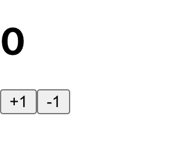
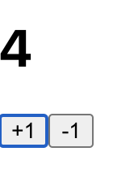

# state 와 useState

## state 란?

> 랜더링 결과물에 영향을 주는 정보이며, 동적인 값 상태를 일컫는다.


## 언제 useState 를 사용하는가?

동적인 값을 화면에 랜더링 해야할때 사용


## useState 소개

리액트 16.8 이전 버전에서는 함수형 컴포넌트에 대해 상태를 관리할 수 없었지만 Hooks 이라는 기능으로 함수형 컴포넌트 상태 관리를 할 수 있게 되었다.


## useState 사용 예시

#### 요구조건 : 아래의 사진과 같이 +1, -1 버튼을 누를 때 마다 상단의 숫자 값이 바뀌게 하라. 초기값은 0으로 설정




### 만들어야 할 것

- 숫자가 출력되는 앨리먼트 (초기에는 0으로 랜더링 되고, 이후 동적인 값이 랜더링되어야한다.)
- +1 버튼 (클릭 이벤트를 설정)
- -1 버튼 (클릭 이벤트를 설정)

  


> src/Couter.js

```javascript
import React from "react";

const onIncrease = () => {
  console.log("+1");
};

const onDecrease = () => {
  console.log("-1");
};
function Counter() {
  return (
    <div>
      <h1>0</h1>
      <button onClick={onIncrease}>+1</button>
      <button onClick={onDecrease}>-1</button>
    </div>
  );
}

export default Counter;
```

이때, 버튼을 클릭할 때에 콘솔에 값이 찍히는 것까지 확인하였다.


> src/Couter.js

```javascript
import React, { useState } from "react"; //리액트 패키지에서 useState 라는 함수를 불러온다.

function Counter() {
  const [number, setNumber] = useState(0);
  // useState(0) : 초기값을 파라미터로 넘겨준다. 이때는 0으로 설정
  // number: 현재 상태의 값
  // setNumber: 값을 갱신하는 함수

  const onIncrease = () => {
    setNumber(number + 1);
  };

  const onDecrease = () => {
    setNumber(number - 1);
  };

  return (
    <div>
      <h1>{number}</h1>
      <button onClick={onIncrease}>+1</button>
      <button onClick={onDecrease}>-1</button>
    </div>
  );
}

export default Counter;
```



### \*\*\* onIncrease, onDecreace 함수가 counter 함수 밖에 적어서 useState도 함수 밖에 작성항였더니 에러가 났다. 컴포넌트 안에서 호출되어야한다고 한다.

<br/>

`React Hook "useState" cannot be called at the top level. React Hooks must be called in a React function component or a custom React Hook`


## 추가 설명

```javascript
const [state, setState] = useState(initialState);
```

- 최초로 랜더링을 하는 동안 반환된 첫번째 인자(state)는 초기값과 같다.
- setState 함수는 state를 갱신할 때 사용, 컴포넌트 리랜더링을 큐에 등록한다.


### 함수적으로 state 갱신하는 방법


앞의 방법은 숫자를 파라미터로 넘기는 방법을 사용하였다. ex) setNumner(1).
다른 방법으로 함수를 넘겨줄 수도 있다. (값을 어떻게 업데이트 할지에 대한 함수)


```javascript
import React, { useState } from "react";

function Counter() {
  const [number, setNumber] = useState(0);

  const onIncrease = () => {
    setNumber((prevNumber) => prevNumber + 1);
  };

  const onDecrease = () => {
    setNumber((prevNumber) => prevNumber - 1);
  };

  return (
    <div>
      <h1>{number}</h1>
      <button onClick={onIncrease}>+1</button>
      <button onClick={onDecrease}>-1</button>
    </div>
  );
}

export default Counter;
```

이 때, 갱신된 새로운 상태값인 숫자 하나를 넘겨주는 것이 아니라 값을 업데이트 하는 함수를 넘겨주었다.
